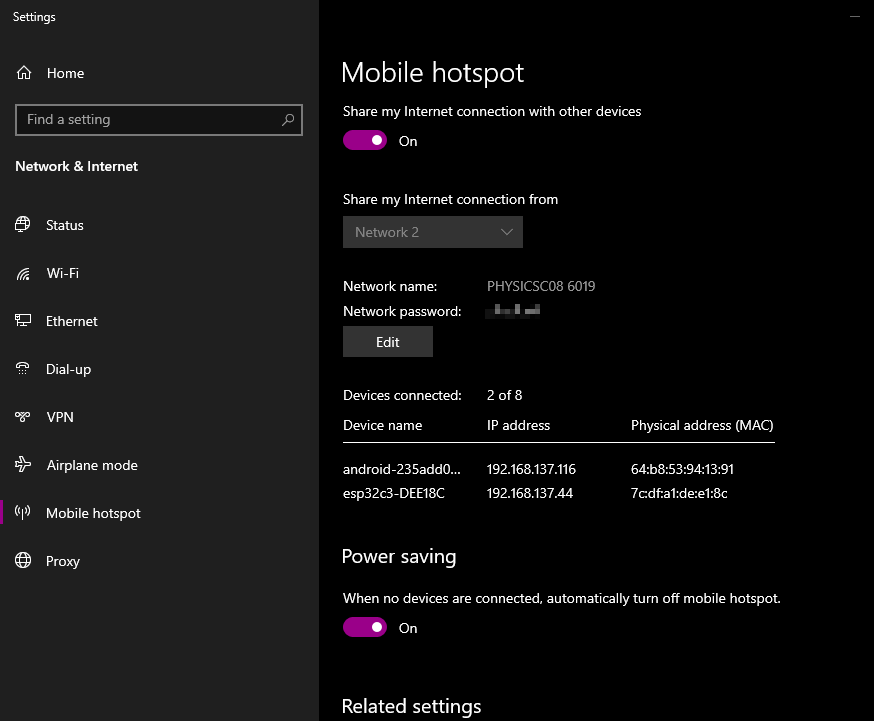

# Sharing Ethernet Connection via WiFi Mobile Hotspot (Windows 10/11)

In some locations the internet is available by wired Ethernet and not by wireless WiFi. Windows 10/11 computers provide an easy way to share the
Ethernet connection as a mobile hotspot usable by ESP32 IoT devices. Many desktop computers don't have built in WiFi but WiFi functionality can be 
easily added using an inexpensive WiFi dongle.

## Creating a Mobile Hotspot on Window 10/11

Microsoft gives a procedure for setting up a  mobile hotspot at:

* https://support.microsoft.com/en-us/windows/use-your-windows-pc-as-a-mobile-hotspot-c89b0fad-72d5-41e8-f7ea-406ad9036b85

If access to your Ethernet connection already is available on the systray one get to the setting more quickly through it. \
In the image below the lower right had a button for Mobile Hotspot. Once clicked on the name of the computer appeared in 
place of the original button.

Within the Mobile Hotspot settings one can create a password (at least 8 characters long). I have pixelated the password in this image.

In this window one can see:

* The Network Name (i.e. the SSID)
* The password (AKA passphrase)
* the number of devices connected to this access point
* the attached device
    * names
	* IP Addresses
	* MAC addresses
	
### Terminal Window Showing Dialogue from ESP32

* One can use either CoolTerm or PuTTY to monitor the ESP32 via a USB virtual COM port
* Connecting the first time requires entering the hotspot credentials (WiFi manager is used in this fork of the project)
* The dialogue will show the IP address of the ESP32 if it connects to the Mobile Access Point
* The ESP32 hostname will also be displayed. On most devices this can be used in the browser. On older Androids the IP address must 
  be used.
  

### Uploading Files onto LittleFS

The screanshots used on this page were uploaded into the ESP32 LittleFS using the interface and transferred to another computer.

	
	