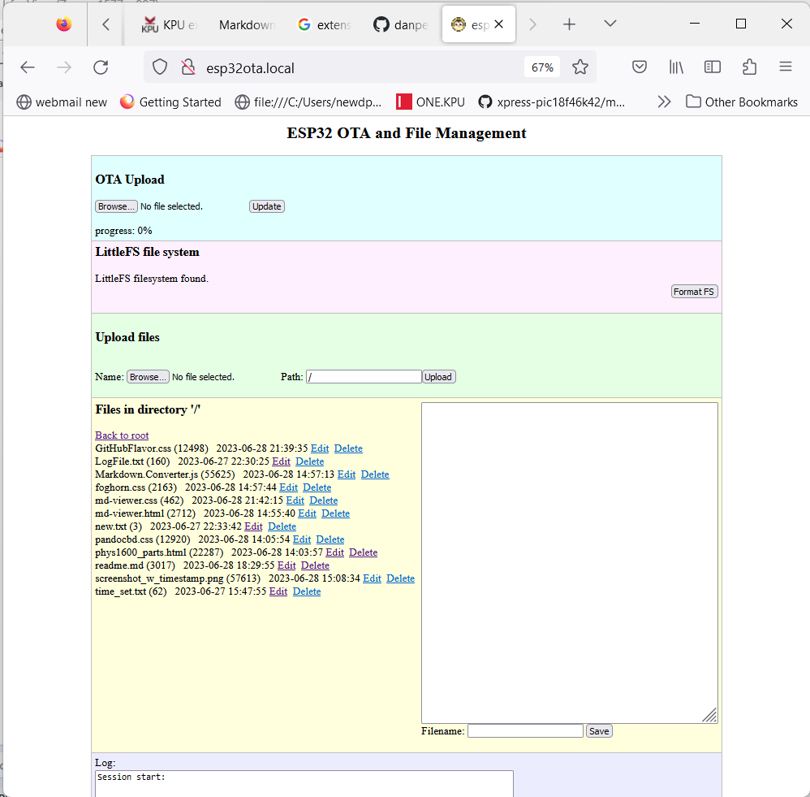

# ESP32 OTA and File System Management

The Arduino V2.0 IDE does not yet include the 'Sketch Data Upload' plugin.

This program provides a web-based interface for

* OTA
* File system formatting
* FS directory listing
* File uploding
* File editing
* File deletion

It may be accessed via from a web browser by its IP address or via http://ESP32OTA.local

The program sets the real time clock in the ESP32 using web provided NTP servers. A timestamp in the file system is updated every time a file is saved. 

### Example Screenshot

## Limitations:

* It must be compiled for either the SPIFFS or LittleFS file system. 
* It does not support LittleFS folder hierarchies.
* ~~WiFi credentials must be compiled in.~~ in my fork I added WiFiManager to avoid compiling in credentials.
* The code has only been tested in a Chrome and Firefox desktop browser on Windows. While it should function correctly in Mozilla-style browsers across 
  all desktop OS platforms, functionality on mobile and other desktop browsers is untested.
* Assumes ESP32 v2.x (ESP32-IDF v4.x) for Arduino 1.8.x or Arduino 2.0.x 
* ~~It does not require additional libraries to be installed.~~ This fork requires the [WiFiManager](https://github.com/tzapu/WiFiManager) library.
* Tested on ESP32-DOWD (WROOM and WROVER) and ESP32-S3 (WROOM).
    * This fork tested on ESP32-S2 DEVKIT 

## To Do

* Add VFS/FATFS support

## How to Use This Code:

* Select a board partition scheme that allows SPIFFS (and OTA if you require it). Either the first option or fourth from the bottom are known to 
  work. Third from the top and fifth from the bottom (large FS) should work on ESP32's with sufficient resources, but haven't been tested.

* Compile and load the program, using Arduino,  onto your ESP32. 
* On first run only attach to ESP access point AP with SSID:  ESP32-FS-AP
    * Point browser to IP address: 192.168.4.1
	* follow prompts to configure SSID (this information is stored in flash -- if it times out reset and try again)
	* ESP will then reconfigure itself to connect to router SSID
* Access the http://ESP32OTA.local URL from your host machine.
* Perform file functions (format, load, edit, delete) and upload other programs (OTA) on the ESP32

## Reason for This Fork

The original code is useful and working; however, I am not comfortable with variable and function definitions 
being located n header files. The header files are now rewritten to contain function declarations and variable declarations. New \*.ino files 
have been created to contain function definitions and variable definitions. The Arduino IDE concatenates the additional \*.ino files at the end of 
the project \*.ino file as preprocessing before compiling.

Decided to add WiFi Manager to avoid hard coding SSID credentials.
