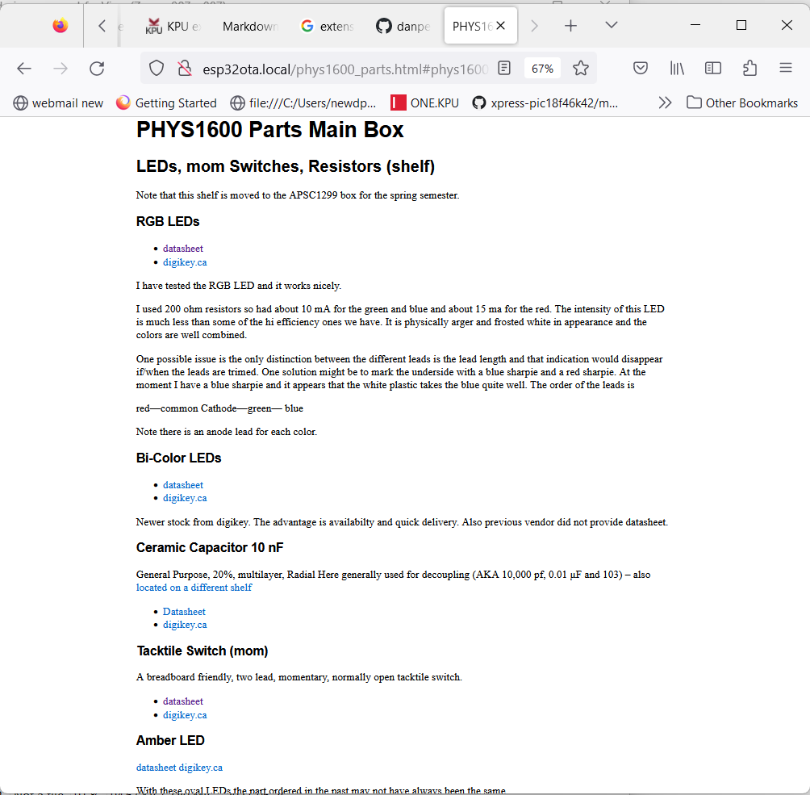
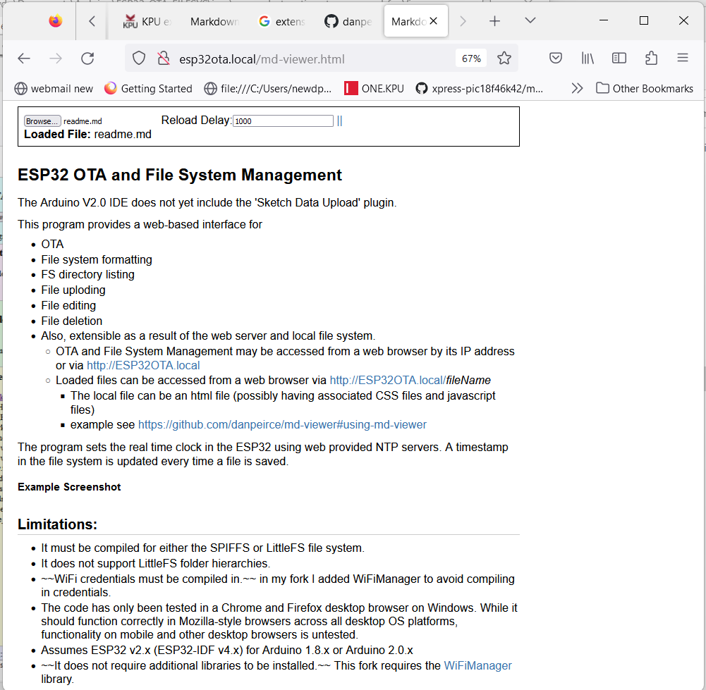

# ESP32 OTA and File System Management

The Arduino V2.0 IDE does not yet include the 'Sketch Data Upload' plugin.

This program provides a web-based interface for

* OTA
* File system formatting
* FS directory listing
* File uploding
* File editing
* File deletion
* Also, extensible as a result of the web server and local file system.
    * OTA and File System Management may be accessed from a web browser by its IP address or via http://ESP32OTA.local
    * Loaded files can be accessed from a web browser via http://ESP32OTA.local/*fileName*
	    * The local file can be an html file (possibly having associated CSS files and javascript files)
        * example see https://github.com/danpeirce/md-viewer#using-md-viewer		

The program sets the real time clock in the ESP32 using web provided NTP servers. 

A timestamp in the file system is updated every time a file is saved.

* For those locations and occasions where the internet is not available the **standalone** branch of this repository provides a solution. A second ESP32 can 
  act as an access point and provide time data via UDP. 
  See 
    * [...danpeirce/ESP32_OTA_FILESYS/tree/standalone](https://github.com/danpeirce/ESP32_OTA_FILESYS/tree/standalone) and
	* [...danpeirce/WiFiAP_time_UDP](https://github.com/danpeirce/WiFiAP_time_UDP)
 

### Example Screenshot

http://ESP32OTA.local

http://esp32ota.local/phys1600_parts.html#phys1600-parts-main-box

http://esp32ota.local/md-viewer.html

## Limitations:

* It must be compiled for either the SPIFFS or LittleFS file system. 
* It does not support LittleFS folder hierarchies.
* ~~WiFi credentials must be compiled in.~~ in my fork I added WiFiManager to avoid compiling in credentials.
* The code has only been tested in a Chrome and Firefox desktop browser on Windows. While it should function correctly in Mozilla-style browsers across 
  all desktop OS platforms, functionality on mobile and other desktop browsers is untested.
* Assumes ESP32 v2.x (ESP32-IDF v4.x) for Arduino 1.8.x or Arduino 2.0.x 
* ~~It does not require additional libraries to be installed.~~ This fork requires the [WiFiManager](https://github.com/tzapu/WiFiManager) library.
* Tested on ESP32-DOWD (WROOM and WROVER) and ESP32-S3 (WROOM).
    * This fork tested on ESP32-S2 DEVKIT 

## How to Use This Code:

* Select a board partition scheme that allows SPIFFS (and OTA if you require it). Either the first option or fourth from the bottom are known to 
  work. Third from the top and fifth from the bottom (large FS) should work on ESP32's with sufficient resources, but haven't been tested.

* Compile and load the program, using Arduino,  onto your ESP32. 
* On first run only attach to ESP access point AP with SSID:  ESP32-FS-AP
    * Point browser to IP address: 192.168.4.1
	* follow prompts to configure SSID (this information is stored in flash -- if it times out reset and try again)
	* ESP will then reconfigure itself to connect to router SSID
* Access the http://ESP32OTA.local URL from your host machine.
* Perform file functions (format, load, edit, delete) and upload other programs (OTA) on the ESP32

## Updated to Use WiFi Favicon

The favicon used in the *head* section of the HTML was replaced to a wifi icon which seemed more fitting for this project.

The new icon can be seen on the tab in the upper right. This replaces the monkey face icon that had been there.

The same technique was used as in the original project. The base64 code was replaced at the end of **webpages.ico**. To convert a favicon.ico file to 
the [base64 encoding example code from a stackoverflow answer](https://stackoverflow.com/questions/6150289/how-can-i-convert-an-image-into-base64-string-using-javascript#56180766) was used.

## Android did not Support mDNS on Older Devices

Android did not support mDNS on older devices (this includes my old phone). Windows computers and apple devices do support mDNS and I am reading newer Adrodid devices also now support it. On most devices http://ESP32OTA.local in the 
location bar of the browser will work. Not on old Android devices. On android my phone from 2013 I must enter the IP address. At home I set my router
to have a IP reservation for the ESP32 so that the IP address is consistent and known.

Update here https://www.androidpolice.com/android-mdns-local-hostname/

## GNU GENERAL PUBLIC LICENSE Version 2

Substantial portions of the code in this project is derived directly from examples in https://github.com/espressif/arduino-esp32 . That repository is licensed under 
the LGPL v2.1 for code libraries. Being primarily a remix of example code it seems fitting that this project should be subject to the GPL.
